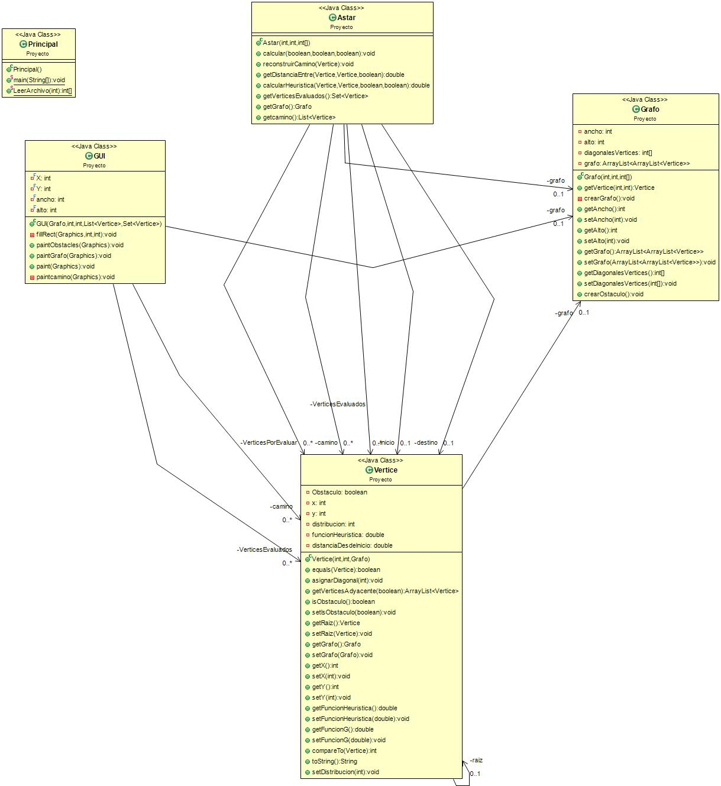

# Proyecto-1---Matematica-Discreta-2
Proyecto 1 correspondiente al curso de Matemática Discreta 2.  
Sección: 10
# Autores:
Carlos Calderón carné: 15219, Julio Barahona carné: 141206 , Diego Castañeda carné:15151

# Descripción
En SRC se encuentran los archivos utilizados para la parte 1, efectuada en Java.
En el caso de la parte 2, esta fue hecha en un solo Script de python.
Ambos programas son orientados a objetos
Para correr la primera parte necesitara tener java, y saber que se uso Swing.
Para la segunda parte necesitara tener python, y tener instalado el modulo Pygame.

# UML

